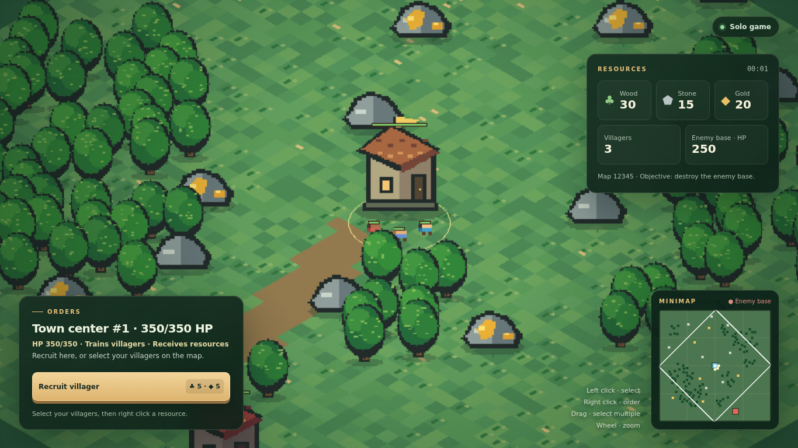

# KC3RTS

A KC3 RTS project with a browser prototype, a persistent KC3 rules worker,
an Elixir/Phoenix development server and a TypeScript/Three.js client.
The large isometric map starts with a town center and three villagers. Its
terrain, buildings, trees, rocks and villagers are pixel art drawn as flat
textures and camera-facing sprites. Wood grows in a starter grove, five small groves and three larger forests.
Stone and gold are sparse, high-capacity deposits; one of each starts near the town center.
Their artwork and click targets are 1.5 times larger than before, while their
resource reserves stay the same. You select villagers and give them
orders to move, gather, build another town center or attack a passive enemy base.
Villagers have circular hitboxes and steer around one another; recruitment
finds free ground around a town center.
Units and buildings have hit points. Destroying the enemy base wins the match.

All artwork is generated in code. Villagers use tiny four-pixel-high figures
that turn left or right as they move; their clothing palette changes with each
match seed. They travel in large hops, roughly one per metre, and lunge from
the edge of resources or the enemy base when an
action lands. Attack lunges follow each unit's attack interval. An order marker
appears immediately when you right-click a target.

## Play now: offline solo prototype

[Play the offline prototype on GitHub Pages](https://baptiste-lg.github.io/KC3RTS/). This is a
solo match simulated in your browser, so it needs no running Phoenix server.
Each visit starts a fresh match; there are no accounts or saved games yet.
Pushes to `main` publish only when all CI checks pass.
Pages executes its solo rules in the browser. The local Phoenix game executes
its playable rules in Elixir. The KC3 rules worker has its own executable
integration tests and is not the engine for either playable mode.



## Play locally

Requirements: Elixir 1.20 with Erlang/OTP 28, Node.js 22.12 or newer, and npm.

Start the game server in one terminal:

```sh
cd server
mix deps.get
mix run --no-halt
```

Start the browser client in another terminal:

```sh
cd web
npm ci
npm run dev
```

Open <http://127.0.0.1:5173/>. Vite relays `/api`, `/socket` and `/health` to the
Phoenix server at `127.0.0.1:4000` during development. Each browser tab creates
an isolated guest match. Its capability is kept in that tab's session storage
for reloads and reconnects. Guest matches expire after 30 minutes without
activity, and the server holds at most 32 at once.

Select villagers with a left click or drag a selection box. Shift-click adds
or removes a villager from the selection; double-click selects all visible
villagers. **Ctrl+A** selects all your villagers. Save a selection with
**Ctrl+1–9**, recall it with **1–9**, and press the number twice to center the
camera on that group. Right-click terrain to move, a
resource to gather, an unfinished town center to build, or the enemy base to
attack. Select a completed town center and press **V** or the recruitment button
to recruit a villager for 5 wood and 5 gold. Select one or more villagers and
press **B** or the construction button, then click free ground to place a town
center for 25 wood and 15 stone. Villagers carry up to 5 units and deliver to
the nearest completed town center. Press **X** to stop selected villagers.
**WASD**, arrow keys or the screen edges pan the camera; the mouse wheel zooms. Click the
mini-map to center the camera elsewhere. The command panel shows the selected
unit's health, current order and cargo. Each new match uses a fresh map seed,
shown in the HUD. The enemy base spawns at a random location and has
250 HP but no AI. There is no opposing army yet.
Add `?quality=low` to the page URL on machines with slow graphics rendering.
Add `?seed=12345` to replay a specific solo map; omit it for a fresh random map.

## Quality checks

Run the same checks as CI from the repository root:

```sh
cd server
mix format --check-formatted
mix credo --strict
mix test
cd ../web
npm ci
npm run lint
npm run typecheck
npm run test:coverage
npm run build
npm run smoke
npm run smoke:pages
```

The browser smoke command starts both services and headless Chrome, then checks
the live WebGL map, WebSocket connection, recruitment and ordered wood delivery.
Chrome or Chromium is required for both smoke commands; set `KC3RTS_CHROME` to its
executable if it is outside the common system paths. `smoke:pages` builds the
static site at `/KC3RTS/` and checks the solo play loop without Phoenix.

To build the pinned KC3 runtime and run the complete server suite with KC3
integration tests and coverage:

```sh
sh scripts/setup-kc3.sh
cd server
export LD_LIBRARY_PATH="../.toolchain/kc3/libkc3:../.toolchain/kc3/lib/kc3/0.1"
KC3RTS_KC3S=../.toolchain/kc3/kc3s/kc3s mix test --cover
```

The setup script checks out KC3 commit `4bdffa88b35a496ca0a856a9eb58486cf6e2029c`
and its pinned submodules into ignored `.toolchain/`. It also builds pinned
`kmx_sort` and `runj` tools there; no system installation of either is needed.
On Ubuntu 26.04 its system build prerequisites are `build-essential`,
`clang`, `libtool-bin`, `libffi-dev`, `libbsd-dev`, `libevent-dev`,
`libgit2-dev`, `libtls-dev`, `pkg-config`, `ruby` and `git`. CI builds the same
commit from a clean checkout. The KC3 worker owns one match's stockpile,
construction reservation and progress,
recruitment checks, tick and revision.

## Architecture

- `kc3/worker.kc3`: a persistent one-match rules worker. It validates initial
  stockpile, building costs and location, construction progress, recruitment,
  player slot and revision. `KC3Worker` starts and monitors it through a bounded
  Elixir port. Its state is separate from the currently playable modes.
- `server/`: playable Elixir simulation and Phoenix WebSocket endpoint.
- `web/`: TypeScript client, Vite development server and Three.js renderer.
- GitHub Pages serves the static browser build with a local deterministic
  simulation. The local development build uses the authoritative Phoenix
  server. The solo build is intended for one visitor per match.
- Rust is reserved for operations shown by profiling to exceed the simulation
  tick budget.

`fixtures/parity_v3.json` compares complete current Elixir and browser states
for five seeded command streams, including crowded movement, depletion and
invalid input. The measured test suites cover 92.53% of server cover points with
KC3 enabled and 95.77% of browser statements; CI enforces coverage floors.

Known limitations: no opposing army or AI, no food or population, no pathfinding
around buildings or resources, no saved match recovery, and no online
multiplayer. Unit steering prevents overlap but can still stall in dense crowds.
The network mode now uses isolated guest matches, revisioned command replies,
compact tick patches and full snapshot resync after a gap. A failed match stops
instead of restarting with a different state. The playable rules are still in
Elixir; this is not yet a KC3-backed public demo.
See [PLAN.md](PLAN.md) for the ordered roadmap and
[KC3 architecture notes](docs/KC3_ARCHITECTURE.md) for the proven boundary.
The [visual baseline](docs/VISUAL_BASELINE.md) and
[performance baseline](docs/PERFORMANCE.md) record current limitations and
repeatable measurements.
The [latest code and CI audit](docs/AUDIT_2026-09-29.md) records verified fixes
and the remaining release risks.

## GitHub Pages setup

This repository publishes through **Settings → Pages → Build and deployment →
Source: GitHub Actions**. When copying the workflow to a new repository, select
that source once. The `pages` CI job builds `web/dist` with the `/KC3RTS/` base
path and publishes it after the server, web and both browser checks succeed on a
push to `main`. Pull requests run checks but cannot publish.

## License

MIT. See [LICENSE](LICENSE).
See [asset and dependency attribution](docs/ASSETS.md).
